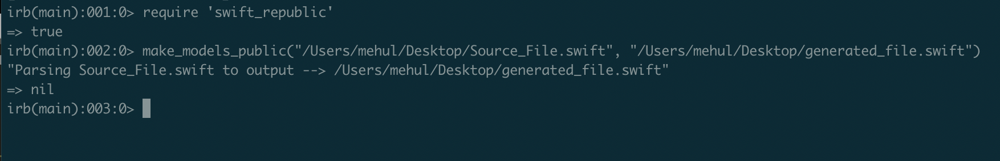

# swift_republic [](https://badge.fury.io/rb/swift_republic) <a href="LICENSE">  </a> <a href="https://swift.org">  </a>

    
A ruby gem to auto-generate public initializers for swift data-models, and update access-control modifiers where needed.  

This gem has been tested to handle the following aspects of your swift code:

- Make protocol declaration public
- Make enum declaration public
- Make struct declaration public
- Make property declaration public
- Create public default memberwise initializers for structs
- Make other initializers public
- Make custom func inside structs and enum public
- Create default initializers with default values where available

Here's a sneak peek into how your code gets transformed:


## Problem defination:

Swift provides the default memberwise initializers for all the structs, as long as they are private, file-private, or internal.
This means, if you had a struct defined like this:  

```
struct Employee {
  let name: String
  let id: Int
}
```
then, you could initialize the employee struct by simply writing let `emp = Employee(name: "Mehul", id: 12345)`.

However, if this struct were to be given a public access, the above way of initializing the struct would no longer work. You would have to manually add the default memberwise initializer to make your code compile again, else the compiler would complain that **there are no accessible initialisers**.

As such, you would be forced to modify the code as follows:
```
public struct Employee {
  public let name: String
  public let id: Int

  public init(name: String, id: Int) {
    self.name = name
    self.id = id
  }
}
```
Now imagine you had hundreds of such data models, along with custom initializers and other functions which you wanted to move to a framework. Adding `public` along each property or function, and manually adding the initilizers is definately a lot of work. This is exactly where the **swift_republic** gem comes to play.

For the more curious ones amongst you, here is the citation from the swift language documentation:

> <b>Default Memberwise Initializers for Structure Types</b> <br><br>
The default memberwise initializer for a structure type is considered private if any of the structure’s stored properties are private. Likewise, if any of the structure’s stored properties are file private, the initializer is file private. Otherwise, the initializer has an access level of internal.

As with the default initializer above, if you want a public structure type to be initializable with a memberwise initializer when used in another module, you must provide a public memberwise initializer yourself as part of the type’s definition.

Also, check that the comments and recent updates here: [https://stackoverflow.com/a/26224873/2020490](https://stackoverflow.com/a/26224873/2020490)

## Installation

Assuming you have Ruby instaled already, install this the same way you would install any other gem:

`gem install swift_republic`

## Making a dry run:

Once installed, you can try running this on the sample code as follows:

Run ruby in interactive mode:

`irb`

`require 'swift_republic'`  (this should print true).

`make_models_public("/path/to/Source_File.swift", "/path/to/generated_file.swift")`



That should generate an output file at the given path.

## More about the gem:

All the ruby script that performs this magic is available in the file [https://github.com/mehul90/swift_republic/blob/master/lib/swift_republic.rb](https://github.com/mehul90/swift_republic/blob/master/lib/swift_republic.rb)

It primarily consists of one method, viz. `make_models_public` which takes the following parameters:

- `source_file` = path to the source swift file (Eg. "/path/to/Source_File.swift")

- `destination_file` = path where you want the auto-generated file to be placed (Eg. "/path/to/generated_file.swift")

- `reserved_keywords` = an optional array of strings, such that if ANY of the strings passed here is detected in ANY line of the source file, the script will no longer generate an output file. This is especially useful when you want to move your data models from app target to framework target, but the data nodel has dependencies on images, localized strings, and other resources which need to be moved to the other bundle  first.

Note that this gem DOES NOT modify the source swift file in any way.

Also note that currently the gem executes in ruby interactive mode, one file at a time, and I plan to add a rake file to handle entire projects in one shot. Stay tuned.

## Sample Input and Output:

[<font size="+3">📥 </font> &nbsp;&nbsp; Sample Input](https://github.com/mehul90/swift_republic/blob/master/resources/Source_File.swift)

[Sample Output &nbsp;&nbsp; <font size="+3">📤</font>](https://github.com/mehul90/swift_republic/blob/master/resources/generated_file.swift)


## Known Exceptions:

- The script does not check if structs in the input file already has default memberwise initializer or not. If it has, the script will still add another one, and the code will not compile.
- A major part of the script relies on the struct being well-formed, and that each opening brace should be matched by a closing brace. <br>Also, there should be only one closing brace in a line. If not, the failing part will be marked in the generated file as "<<--Please fix formatting there, and run again." meaning you  need to fix this part in the source file, and run the script again.
- Function names, property names, or variable names containing swift data types like "struct" or "enum" or "func" could fail, since the parser look for these keywords. For example, `let microstructures: [String]` or `var isMalfunction: Bool` could create problems.


## And finally:

Note that the script is designed to be scalable and easy to read (thus allowing more space for improvements), and may not necessarily use the fastest/shortest ruby syntax.

If this gem 💎 saved your time, please feel free to star 🌟the repo and share it with your friends.

For any issues/improvements, please feel free to open an issue 📝 or create an PR 👨‍💻.

